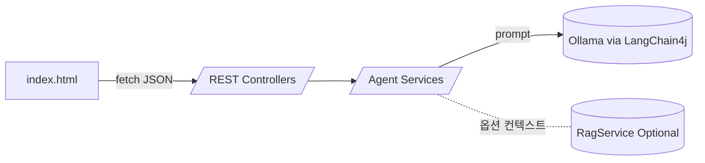

# function.md - Mail Assistant 기술 적용 정리

## 개요
- 로컬 LLM(Ollama)과 LangChain4j로 이메일/개발문서 에이전트 제공, UI는 `src/main/resources/static/index.html`의 fetch 기반 단일 페이지.
- 세 개의 진입점: 일반 메일 챗(`MailAssistantController`), Email Agent(`EmailAgentController`), DevDoc Agent(`DevDocAgentController`).
- RAG·도구 호출·함수 호출은 스켈레톤만 연결되어 있으며 실제 검색/호출 로직은 아직 미구현 상태.

## Ollama 연동
- **Chat 모델**: `LlmConfig`와 `OllamaConfig`에서 `OllamaChatModel`을 생성(`modelName="llama3.2:3b"`, `baseUrl=http://localhost:11434`, 타임아웃/temperature 지정). Email/DevDoc 모델을 Bean 이름으로 분리해 각 서비스에 주입.
- **Embedding 모델**: `RagConfig.embeddingModel()`에서 `OllamaEmbeddingModel`(`nomic-embed-text`)을 Bean으로 등록해 추후 RAG에 활용 가능하도록 준비.
- 서버 의존성은 README에 명시된 `ollama pull llama3.2:3b`, `ollama pull nomic-embed-text`로 충족.

## LangChain4j 사용 지점
- 모든 LLM 호출은 `ChatLanguageModel.generate(String prompt)` 단일 호출로 수행. 체인/메모리 없이 프롬프트 엔지니어링 방식.
- **EmailAgentServiceImpl.generateDraft**: tone/mailType/추가 컨텍스트를 합쳐 영문 비즈니스 메일 생성. mailType별 구조 힌트 포함.
- **EmailAgentServiceImpl.checkDraft**: 체크리스트(한글)와 메일 원문을 함께 보내 개선 제안 bullet을 요청.
- **DevDocAgentServiceImpl.answerQuestion**: Summary/Detailed Answer/Referenced Snippets 섹션을 강제하는 Markdown 포맷을 프롬프트로 지정 후 LLM 응답을 파싱.
- **DevDocAgentServiceImpl.generateStudyNote**: 섹션 헤더를 미리 정의해 Markdown 학습 노트 생성.
- **MailAssistantController.chat**: 가장 단순한 예시로 한글 입력→정중한 한글 메일 작성.

## RAG(LangChain4j Embedding) 상태
- 공통 인터페이스 `RagService.retrieveRelevantTexts(query, topK)` 정의.
- **EmailRagServiceImpl**, **DevDocRagServiceImpl**는 모두 TODO 스켈레톤으로 단일 문자열을 반환하며 실제 검색 없음.
- 서비스 계층에서는 `Optional<RagService>`를 주입만 해두고, RAG 결과를 프롬프트에 주입하는 코드 블록을 주석 처리해 확장 지점을 명확히 표시.
- EmbeddingStore/로컬 데이터(`data/email-examples`, `data/dev-docs`) 인덱싱 로직은 미작성 → LlamaIndex도 전혀 사용되지 않음.

## 함수 호출(Function Calling) / Tool Use / Workflow 적용 현황
- LangChain4j의 도구 호출, 함수 호출, 워크플로우(체인/메모리/스텝 실행) 기능은 사용하지 않음.
- 현재 흐름은 "HTTP 요청 → Service에서 프롬프트 문자열 구성 → 단일 generate 호출" 형태의 직선형 워크플로우.
- 잠재 확장 아이디어:
  - LangChain4j `ToolSpecification`을 이용해 캘린더/템플릿 조회 등을 함수 호출 방식으로 위임.
  - Embedding 기반 RAG를 활성화하여 사전 검색 → 컨텍스트 주입.
  - 간단한 state machine(예: 이메일 타입 감지 → 템플릿 채우기 → 검수)으로 멀티스텝 워크플로우 구성.

## HTTP/API & UI 흐름
- **UI**: `index.html`이 fetch로 각 REST 엔드포인트 호출, 응답 JSON을 그대로 표시하며 초안 결과를 체크리스트 입력란에 자동 복사.
- **엔드포인트**:
  - `/api/assistant/chat`: 단일 LLM 호출로 한글 메일 생성.
  - `/api/agent/email/draft`, `/api/agent/email/checklist`: Email Agent 전용 초안/체크리스트.
  - `/api/agent/devdoc/qa`, `/api/agent/devdoc/note`: DevDoc Q&A/노트 생성.
- **테스트**: Controller 단위 테스트에서 `@MockBean`으로 LLM을 대체해 Ollama 의존성을 제거.

## 간단 아키텍처 도식

## 한눈에 보는 적용 요약
- Ollama: Chat/Embedding 모델 Bean으로 분리 주입.
- LangChain4j: 프롬프트 엔지니어링 기반 단일 generate 호출.
- RAG: 인터페이스/EmbeddingModel 준비만 완료, 실제 검색 미구현.
- LlamaIndex: 사용 안 함.
- Function Calling/Tool Use/Workflow: 미적용, 추후 확장 여지만 주석과 설계 힌트로 명시.
